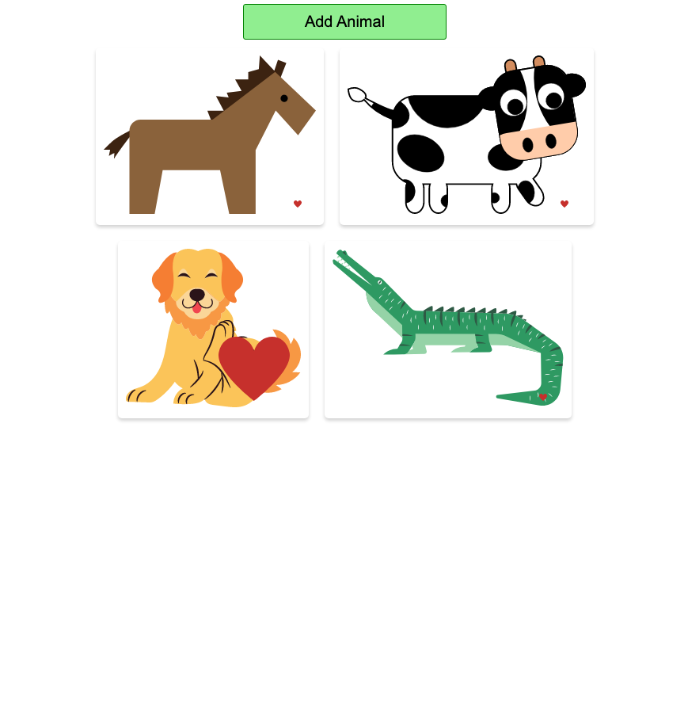

# Animals

## Description
A practice React app to demonstrate: 
- `Events` 
- `useState`
- `Event Handlers`
-  `List building` 
- `Images`

Users can click `Add Animal` to get a new random animal picture. If you like the animal you can click the heart icon and it will continue to grow in size based on how many times you click it.

[Click here](https://blksmk8483.github.io/animals/) to try it out yourself.

Again, this app is for practice purposes only. A very novel app but demonstrates a lot of core concepts used in REACT.

